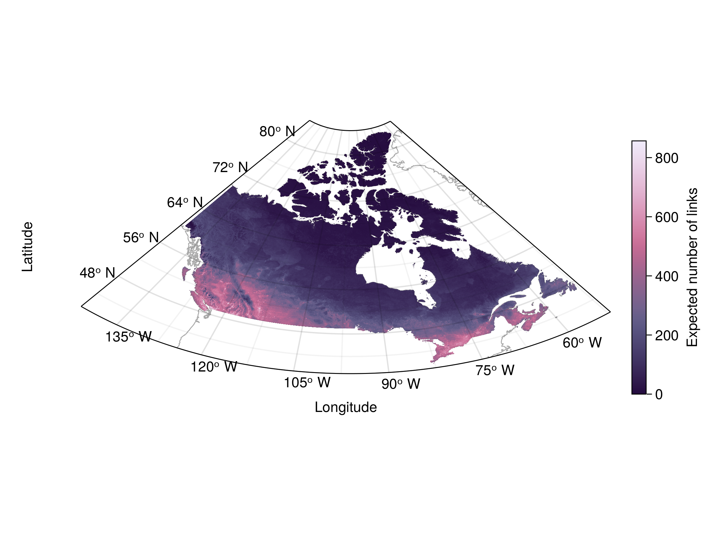

## Methods

@Fig:conceptual shows a conceptual overview of the methodological steps. The components were grouped as the inputs (spatial or non-spatial), the localized steps (divided into single-species-level, two-species-level, and network-level steps), and the final spatial output.

### Inputs

The inputs were divided into two main categories: the spatial and non-spatial ones (*Inputs* box on @Fig:conceptual).

The main building block for the interaction data was the metaweb for Canadian mammals from @Strydom2022FooWeb, a non-spatial input (represented as nodes and links on @Fig:conceptual). As stated above, a metaweb contains all the possible interactions between the species found in a given regional species pool [@Dunne2006NetStr]. The species list for the Canadian metaweb was extracted from the International Union for the Conservation of Nature (IUCN) checklist [@Strydom2022FooWeb]. Briefly, the metaweb was developed using graph embedding and phylogenetic transfer learning based on the metaweb of European mammals, which is itself based on a comprehensive survey of interactions reported in the scientific literature [@Maiorano2020TetSpe]. The Canadian metaweb is probabilistic, which has the advantage of taking into account that species do not necessarily interact whenever they co-occur [@Blanchet2020CoOcc]. However, the Canadian metaweb is not explicitly spatial: it only gives information on interactions in Canada as a whole and does not represent networks at specific locations. Local networks, on the other hand, are realizations from the metaweb resulting from sorting the species and the interactions [@Poisot2015SpeWhy]. A spatial and localized metaweb is not equivalent to the local networks, as it will have a different structure and a higher connectance [@Strydom2022PreMet]. Therefore, producing a spatial metaweb requires additional steps to account for species composition and interaction variability in space.

The spatial data used to develop the spatial component of the metaweb were species occurrences and environmental data. First, I extracted species occurrences from the Global Biodiversity Information Facility (GBIF; www.gbif.org) for the Canadian mammals using `GBIF.jl` [@Dansereau2021SimJl]. Since GBIF observations represent presence-only data and most predictive models require absence data, I generated pseudo-absence data using the surface range envelope method available in `SimpleSDMLayers.jl` [@Dansereau2021SimJl]. This method generates pseudo-absences by selecting random non-observed locations within the spatial range delimited by the presence data [@Barbet-Massin2012SelPse]. Then, I used environmental data and species distribution models [SDMs, @Guisan2005PreSpe] to predict the distribution of Canadian mammals across the whole country. The environmental data I used were the 19 standard BIOCLIM climate variables from WorldClim 2.0 [@Fick2017WorNew] and the 12 consensus land cover variables from EarthEnv [@Tuanmu2014Glo1km]. The climate variables represent various measures of temperature and precipitation (e.g., annual ranges, monthly maximum or minimum, seasonality) and are available for land areas across the globe. Therefore, they can be used to capture the climatic tolerance of species and model habitat suitability in new locations. The WorldClim data are available at various resolutions. I decided to use the 2.5 arcmin resolution (around 4.5 km at the Equator) as a compromise to catch potential local variations while limiting computation costs to a manageable level. The land cover variables represent classes such as Evergreen broadleaf trees, Cultivated and managed vegetation, Urban/Built-up, and Open Water. Values range between 0 and 100 and represent the consensus prevalence of each class in percentage within a pixel at a 1-km resolution. Since this is finer than the resolution for the climate data, I coarsened the land cover ones to the same 2.5 arcmin resolution using @GDAL/OGRcontributors2021GdaOgr.

Our selection criteria for choosing an SDM algorithm was to have a method that generated probabilistic results, including both a probability of occurrence for a species in a specific location and the uncertainty associated with the prediction. These were crucial to obtaining a probabilistic version of the metaweb as they were used to create spatial variations in the localized interaction probabilities (see next section). One promising method for this is Gradient Boosted Trees with a Gaussian maximum likelihood from the `EvoTrees.jl` *Julia* package (https://github.com/Evovest/EvoTrees.jl). This method returns a prediction for every pixel with an average value and a standard deviation, which I used as a measure of uncertainty to build a Normal distribution for the probability of occurrence of a given species at all pixels (represented as probability distributions on @Fig:conceptual).

### Localized steps

The next part of the method was the localized steps which produce local metawebs in every pixel. This component was divided into single-species, two-species, and network-level steps (*Localized steps* box on @Fig:conceptual).

The single-species steps represented four possible ways to account for uncertainty in the species distributions and bring variation to the spatial metaweb. I explored four different options to select a value from the occurrence distributions obtained in the previous steps (Inputs section): 1) taking the mean from the distribution as the probability of occurrence (option 1 on @Fig:conceptual); 2) converting the mean value to a binary one using a specific threshold per species (option 2); 3) sampling a random value within the Normal distribution (option 3); 4) converting the random value into a binary result (option 4). The threshold ($\tau$ on @Fig:conceptual) used was the value that maximized Youden's *J* informedness statistic [@Youden1950IndRat], the same metric used by @Strydom2022FooWeb at an intermediate step while building the metaweb. The four sampling options were intended to explore how uncertainty and variation in the species distributions can affect the metaweb result and reproduce some of the filterings that create the local network realizations [@Poisot2015SpeWhy]. I expected thresholding to have a more pronounced effect on network structure as it should reduce the number of links by removing many of the rare interactions [@Poisot2016StrPro]. Meanwhile, I expected random sampling to create spatial heterogeneity compared to the mean probabilities, as including some extreme values should disrupt the potential effects of environmental gradients.

Next, the two-species steps aimed to give the probability of observing a given interaction in a location. For all species pairs, I multiplied the two species' occurrence probability obtained using the sampling options described in the previous paragraph, then multiplied the co-occurrence probability by the interaction probability from the Canadian metaweb.

The network-level steps then created the probabilistic metaweb for the location. I assembled all the local interaction probabilities (from the two-species steps) into a probabilistic network [*sensu* @Poisot2016StrPro]. I then sampled several random network realizations to represent the potential local realization process [@Poisot2015SpeWhy]. Finally, this resulted in a distribution of localized networks, which I averaged over the number of simulations to obtain a probabilistic network.

### Outputs and additional steps

The final output of my method was the spatial probabilistic metaweb, which contains a localized probabilistic metaweb in every cell across the student extent (Outputs box on @Fig:conceptual). This gives us an idea of the possible networks in all locations as the metaweb essentially serves to set an upper bound on the potential interactions [@Strydom2022PreMet], but with the added benefit of accounting for co-occurrence probabilities in this case. From there, I can create maps of network properties (e.g. number of links, connectance) measured on the local realizations, display their spatial distribution, and compute some community-level measures such as species richness. Importantly, I can also calculate the uncertainty associated with the network and community measurements and contrast their spatial distribution. I computed uncertainty for species richness by summing the standard deviations of the species occurrence probabilities. For networks, I computed link variance based on the link probabilities according to @Poisot2016StrPro. I then contrasted their spatial distributions to identify areas where their uncertainty matches. These would either indicate that we should trust the predictions (if the uncertainty is low) or need more sampling (if the uncertainty is high) to improve our current knowledge. On the other hand, identifying areas where the richness and link uncertainty do not match would also be highly informative. It could lead to targeted sampling programs for either component (community or network composition).

I compared the compositional uniqueness of the networks and the communities to verify if they indicated different exceptional areas. I measured uniqueness using the local contributions to beta diversity [LCBD, @Legendre2013BetDiv], which identify sites with exceptional composition by quantifying how much one site contributes to the total variance in the community composition. While many studies used LCBD values to evaluate uniqueness on local scales or few study sites [for example, @daSilva2014LocReg; @Heino2017ExpSpe], recent studies used the measure on predicted species compositions over broad spatial extents and a large number of sites [@Vasconcelos2018ExpImp; @Dansereau2022EvaEco]. LCBD values can also be used to measure uniqueness for networks by computing the values over the adjacency matrix, which has been shown to capture more unique sites and uniqueness variability than through species composition [@Poisot2017HosPar]. Here, I measured and compared the uniqueness of our localized community and network predictions. I was especially interested in seeing if the sites identified as unique were the same based on the species and the interactions or if this method allowed identifying areas unique for one element (interactions, for instance) but not the other. Sites with such mismatches should warrant more investigation to understand the reasons for this difference.

## Preliminary results

Preliminary results are presented in the Appendix section. All results shown are based on the first sampling strategy (option 1) mentioned in the Localized steps section above, where species occurrence probabilities were taken as the mean value of the distribution (see below for a discussion on the other strategies).

@Fig:mean shows how the method allowed representing the spatial distribution of community-level measures (species richness in this example, @Fig:mean_richness) and network-level ones (total number of links, @Fig:mean_links). Importantly, the novel element shown here is that both community and network-level measures presented are not predictions of the measure itself but were instead computed over localized predictions of the communities and networks. The two measures both showed a latitudinal gradient with higher values in the south. They also showed higher values near cities, which might indicate a bias from the larger amount of observations near populated areas and warrant further investigation. However, the spatial distribution of richness and link did show some differences and areas of mismatches, both regarding the estimates themselves and regarding their uncertainties ([@Fig:bivariate]). Sites in the south mostly displayed high species richness and a high number of links, while sites with low values for both were mainly in the north ([@Fig:bivariate_estimates]). However, a striking result is that once grouped as quantiles, many sites in the north displayed high richness and a low number of links. Moreover, most of these sites are on the terrestrial border of islands and next to the ocean, showing a form of "border effect". These results call for some investigations into the results from our species distribution models (see Next steps section below).

The spatial distributions of richness variance and link variance, which can be taken as measures of uncertainty, mostly matched but still highlighted areas where the uncertainty was higher for one more than the other ([@Fig:bivariate_uncertainty]). For instance, areas with high richness variance and low link variance were mainly between 50 and 60 degrees of latitude. In contrast, sites with low richness variance and high link variance mainly occurred further north.

The preliminary results also indicate a mismatch between the uniqueness of communities and networks. While many areas were unique for both their community and interaction compositions, other regions were unique for one element but not the other ([@Fig:lcbd_bivariate]). For example, the Maritime Provinces had a highly unique species composition but a network composition that was common elsewhere. Interestingly, these results displayed a form of latitudinal gradient, with most sites unique for species composition only (in cyan on @Fig:lcbd_bivariate) occurring in the south near the border with the United States and most sites unique for their network composition only (in pink) occurring in the north. These mismatched sites formed two distinct groups when evaluating the relationship between species richness and the number of links ([@Fig:lcbd_scatter]). The areas only unique for their species composition had both a high richness and number of links. On the other hand, the sites only unique for their networks had both lower richness and a lower number of links, although they were not the sites with the lowest values for both.

Since both species composition and network LCBD display a high spatial variation and complex patterns, it might be beneficial to simplify the representation of their distribution. One possible way to do this meaningfully is to group sites by ecoregion, as species and interaction composition have been shown to differ between ecoregions across large spatial scales [@Martins2022GloReg]. To do so, I used the global map of ecoregions from [@Dinerstein2017EcoApp; also used by @Martins2022GloReg], selected only the 44 ones in Canada, then extracted for each ecoregion the median LCBD value from all the sites in the ecoregion. The species and network (median) ecoregion LCBD showed slightly different spatial distributions, including higher network LCBD values in the north ([@Fig:ecoregion_lcbd]a-b). When comparing the values, network LCBD values for ecoregions spanned a narrower range between the 44 ecoregions than species LCBD values ([@Fig:ecoregion_lcbd]c). Moreover, variation within the ecoregions was also lesser for network values, with generally lower 89% interquantile ranges among the site-level LCBD values ([@Fig:ecoregion_lcbd]d).

Finally, @Fig:sampling_options shows the potential effect of the different sampling strategies on species richness. Compared to the mean option (top left, also used for the other figures), thresholding the occurrence probabilities to binary values reduced species richness (right side figures). In contrast, random sampling for the probability distributions generated higher heterogeneity and a "grainy" resolution (bottom figures). Given the computational constraints associated with representing the localized networks for all of Canada, I have not yet explored the effect of the four sampling options on network composition.

## Discussion

The spatial probabilistic metaweb I produced here is a first attempt at downscaling a metaweb and producing localized predictions, as called for by @Strydom2022PreMet. It gives us an idea of what local metawebs or networks could look like in space, given the species distributions and their variability, as well as the uncertainty around the interactions. It is the first representation in space of the metaweb of Canadian mammals [@Strydom2022FooWeb], which is not spatialized. This is conceptually similar to how the European tetrapod metaweb [@Maiorano2020TetSpe], on which the Canadian metaweb was based, was used to predict localized networks [@Braga2019SpaAna; @OConnor2020UnvFoo; @Galiana2021SpaSca; @Gauzere2022DivBio; @Botella2023LanInt]. This led, among others, to developments on the structure of food webs over space [@Braga2019SpaAna], on the scaling of network area relationships [@Galiana2021SpaSca], and on the effect of land-use intensification on food webs [@Botella2023LanInt]. Our approach opens similar possibilities of investigations in North America with food webs of Canadian mammals.

Furthermore, a key distinction is that our approach is probabilistic, does not assume species interact whenever they co-occur, and incorporates variability based on environmental conditions from the species occurrence distributions. In comparison, previous studies with local network predictions based on metawebs instead assembled binary networks and recorded an interaction whenever two species with a known interaction in the metaweb co-occurred [@Braga2019SpaAna; @OConnor2020UnvFoo; @Galiana2021SpaSca; @Gauzere2022DivBio; @Botella2023LanInt]. According to @Braga2019SpaAna, assuming interactions as constant across space was a potential limitation to their design, as it a) ignores behaviour variability (diet shift) and potentially inflates the number of interactions; and b) does not consider the effect of environmental conditions on interaction realization. In contrast, our framework compensates for those in some way using our probabilistic metaweb. First, our network estimates (e.g. total number of links on @Fig:mean_links) are likely less inflated and more realistic, as binary networks overestimate connectance and nestedness compared to probabilistic ones [@Poisot2016StrPro]. Second, while we do not model interaction probability based on environmental conditions directly, we do incorporate environmental variability through the co-occurrence probabilities based on climate and land cover data. We also assess the uncertainty around this measure, which could be used as a quantitative proxy for environmental variability in further investigations. Third, another way in which our framework might differ is by introducing a different association between species richness and network properties. @Galiana2021SpaSca found that species richness had a large explanatory power over network properties but mentioned it could potentially be due to interactions between species being fixed in space. Our framework partly responds to that, as local interaction values are never the same as in the metaweb because we considered co-occurrence probabilities. Moreover, in the very rare case where two sites would have the exact same co-occurrence probabilities, the local interaction probabilities would be different because of the random draws of local realizations in the final assembly step. As a result, we did find differences in the distribution of species richness and the number of links (@Fig:bivariate_estimates); therefore, it might be interesting to revisit the explanatory power of species richness over networks properties [as done by @Galiana2021SpaSca].

Our LCBD and uniqueness results highlighted that sites with unique network composition might differ from sites with unique species composition. @Poisot2017HosPar showed a similar result with host-parasite communities of rodents and ecto-fleas. Our results further show how these site differences could be distributed across a broad continuous spatial extent. Areas unique for only one element (species or network composition) differed in their combination of species richness and number of links (@Fig:lcbd_scatter), with species-unique sites displaying high values of both measures and network-unique sites displaying low values. One possible explanation for this could be the difference in the proportion of rare "events" in the community and interaction matrices, which would respectively be rare species and rare interactions. Communities with a low proportion of rare species show a negative relationship between their species richness and LCBD score, while communities with a higher proportion instead show a positive relationship [@daSilva2018DisCor; @Yao2021EcoUni; @Dansereau2022EvaEco]. However, rare species and rare interactions are probably not distributed in the same way; therefore, those "rare events" could possibly influence LCBD scores in different ways and determine different unique sites.

# References

![Conceptual figure of the workflow to obtain the spatial probabilistic metaweb (Chapter 1). The workflow has three components: the inputs, the localized steps, and the final spatial output. The inputs are composed of the spatial data (data with information in every cell) and the non-spatial data (constant for all of Canada). The localized steps use these data and are performed separately in every cell, first at a single-species level (using distribution data), then for every species pair (adding interaction data from the metaweb), and finally at the network level by combining the results of all species pairs. The final output coming out of the network-level steps contains a spatialized probabilistic metaweb for every cell across the study extent.](figures/conceptual-figure.png){#fig:conceptual}

<!-- Main richness & links figures -->

  {#fig:mean_richness height=40%}

  {#fig:mean_links height=40%}

Example of a community measure (a, expected species richness) and a network one (b, expected number of links). Both measures are assembled from the predicted probabilistic communities and networks, respectively.

<!-- Bivariate figures -->

  {#fig:bivariate_estimates height=40%}

  {#fig:bivariate_uncertainty height=40%}

Bivariate representation of the estimates (a) and uncertainty (b) of species richness and the number of links. Values are grouped into three quantiles separately for each variable. The colour combinations represent the nine possible combinations of quantiles. The richness (horizontal axis) goes left to right from low richness (light grey, bottom left) to high richness (green, bottom right). The number of links goes bottom-up from low (light grey, bottom left) to high (blue, top left).

\newpage

<!-- LCBD -->

{#fig:lcbd_bivariate}

\newpage

<!-- LCBD densities -->

![Difference in the grouping of the sites identified as unique only for their networks (pink) or only their species composition (cyan). Sites unique only for their species composition mostly have high species richness and a high number of links while sites unique for their network composition only have low richness and number of links. Other sites not belonging to the unique species or network groups are shown in the background (black) and span a wider range. Values on the y-axis for the density figures (right) are probability densities scaled so that the area under the curve equals one. Similarly, the area under the curve for a given range of values on the x-axis (richness or links) represents the probability of observing a value in that range for the different site groupings.](figures/lcbd_bivariate_densities.png){#fig:lcbd_scatter}

\newpage

<!-- Ecoregion LCBD -->

![Representation of the ecoregion LCBD values based on species composition (a) and network composition (b). LCBD values were first computed across all sites and scaled relative to the maximum value observed. The ecoregion LCBD value is the median value for the sites in the ecoregion. The bottom figures represent the probability densities of: c) the (median) ecoregion LCBD values for species and network LCBD, highlighting the variability of the LCBD between ecoregions, and d) the 89% interquartile range of the values within each ecoregion, highlighting the variability within the ecoregions.](figures/ecoregion_LCBD_all_included.png){#fig:ecoregion_lcbd height=85%}

<!-- 
 -->

\newpage

<!-- Sampling options -->

{#fig:sampling_options}