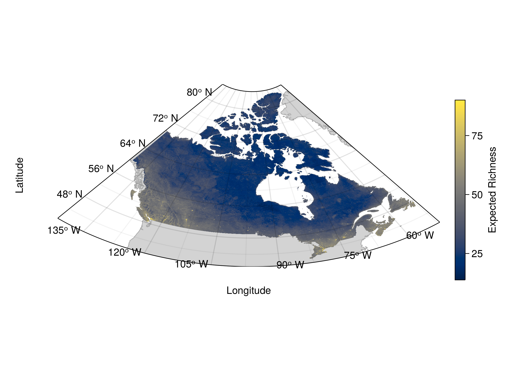
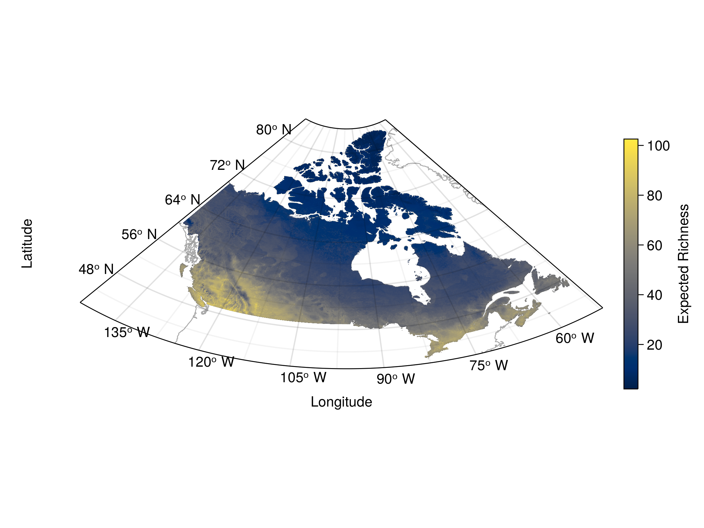

# RSTB-2023-0166 Author response to reviewers

We would like to thank both reviewers for their helpful input on our manuscript. Following their comments, we did two main changes.

First, we added an analysis of network motifs across ecoregions to further explore the variation in network structure across space beyond richness and number of links, as both reviewers suggested. We added a new figure with those results (now Fig. 4, attached in this document as well). We decided to move our previous Fig. 3 (showing the bivariate relationships between community and network measures) to Supplementary Material (now Fig. S1) to respect the Journal's limit on the number of figures. However, we will gladly put it back in the main text if the Editor judges that we have room for it.

Second, we followed Reviewer 1's suggestion regarding pseudo-absences and changed our random selection algorithm for one which weights candidate sites by their distance to an observation, making it more likely to select sites further away from observed ones. We believe that doing so allows us to better represent the potential distributions of species, as Reviewer 1 mentioned. Consequently, we re-ran our species distribution models and updated our figures given the new distributions. This does not change the conclusions from our manuscript, except for one result which is worth discussing below. Otherwise, our results are very consistent, notably regarding the latitudinal gradients of species richness and number of links, the differences in the spatial distributions of ecoregion median values and within-ecoregion variance, and the contrast between hotspots of network and species uniqueness.

The one result which differs from our previous version is the mismatch in the distributions of species richness and number of links that we reported in our earlier analyses. As we can see on our updated Fig. 1 and Fig. S1, both spatial distributions now follow each other quite closely, while they showed clear differences before. Nonetheless, we believe this result follows logically from the change of focus towards potential distributions and is preferable for two reasons. First, as Reviewer 1 pointed out, modelling potential distributions and wider responses to the environment makes more sense to go along with the metaweb concept. The metaweb and its downscaled localized version we present here are highly potential in nature and aim to serve as an upper boundary for what the interactions could be at a local scale. Therefore, using potential distributions ensures that we capture the widest potential response given the environment. Second, changing the pseudo-absence generation method smoothed out the results for species richness and reduced over-fitting towards the cities, which we think is more appropriate here (we attached the previous and updated richness figures for comparison below, Figs. R1-R2). As we now select pseudo-absences further away from the species occurrences, our distribution models essentially do in-filling within the observed species range and are likely to generate distributions with less holes. Notably, species richness increased in most areas, now reaching a maximum around 100 compared to 85 before (as visible below). Consequently, the number of links increased even more than richness (from a maximum around 700 links up to 850 links). Given the increase in richness, species can realize their interactions with the highest probabilities in more locations except in very poor sites. Doing so, we believe it normal to observe a better agreement between the two distributions, as there is now less of a spatial constraint on where species can realize their interactions.

Please also find below our point-by-point response to all comments from the reviewers.

\setcounter{figure}{3}

![Comparison of the dominant ecological motifs across ecoregions. A) Normalized Difference Index (NDTI) comparing the trophic motifs S1 (tri-trophic food chains) and S2 (omnivory). Positive values indicate a dominance of S1 while negative values indicate a dominance of S2. Values equal or superior to |0.5| are shown with the same color as they indicate a high dominance of one motif. B) Normalized Difference Index (NDCI) comparing the competition motifs S4 (exploitative competition) and S5 (apparent competition). Positive values indicate a dominance of S4 while negative values indicate a dominance of S5. (C-D) Representation of the 89% interquantile range of values within the ecoregion for the trophic motifs index (NDTI, C) and competition motifs index (NDCI, D).](figures/motifs_ecoregion_NDI_4panels.png)

\renewcommand{\thefigure}{R\arabic{figure}}
\setcounter{figure}{0}

{#fig:previous height=45%}

{#fig:updated height=45%}

## Reviewer 1

> Thank you for a great paper. I really like the design of your workflow, and I think it provides a sound and solid way of downscaling the metawebs into ecoregion or local webs, that could foster new analyses of different taxa and regions. Just to be clear, I believe the structure of your workflow seems quite sound to me, and the way it embeds probabilistic measures of potential distributions and potential interactions may help modelling the variability that local networks may have in nature in a realistic way. In fact, I do look forward to see comparisons of these potential networks with empirical networks (and where do realized networks lie within the possible networks), but that’s a different step, that first requires developing the analytical framework that you are presenting here. I only have two major suggestions which, I believe, would sharpen and strengthen your workflow, and a specific comment.  

We are grateful to Reviewer 1 for their positive comments and understanding of our manuscript.

> Why do you use random pseudoabsences within the species range to construct the Species Distribution Models if you want to represent the potential distribution? You do it throughout all the range of the data, but that includes both areas within the species range, and areas outside of it. I’m telling this because the decision is not meaningless in terms of whether you model current distributions (where including absences in places within the range to include areas that could host presences but are unoccupied by the species matters) or potential distributions (where capturing the wider responses to the environment is what matters). That is, capturing where the species is vs where the species could be. A consequence of this is that how you pick pseudoabsences is a key choice, and I believe you may have taken the wrong direction. There are examples in the literature about how to make this choice, but if you would create them from outside of the observed range of the species, or assigning lower probability to choosing non-sampled places within the known species range I believe your models will represent potential distribution much better. If you do so, this should be much clear in the text.  

As mentioned above, we agree with the reviewer that we should aim to model potential distributions and wider responses to the environment and clarified it on **LXYZ**. We followed the reviewer's suggestion and assigned a lower probability of choosing pseudo-absences near occurrences (therefore the known species range) and a higher probability of choosing sites further away.
  
> Your spatial comparison between richness and network size is so great that I wonder whether you do not explore other aspects of network structure, such as nestedness and modularity. These metrics may help understanding better the spatial mismatches between richness and number of links shown in figs 3 and 4, as if I’m getting it correctly, these may be caused by the selection of a handful modules in the northern ecoregions, compared to more connected networks towards the south-southwest.  

We added an analysis of network motifs to further explore network structure in space. We chose motifs over nestedness and modularity as they capture much of the variation in network structure, are linked to community persistence, and are conserved across scales, on top of having an intuitive interpretation (e.g. what type of competition between three species is more common in a network).

> Line 162; rather than potential effects (which to me includes all potential variation associated to the probabilistic models) I would say “main/overall trends promoted by environmental gradients”, or something similar, emphasizing that the variability creates “noise” in local networks, but that such “noise” is realistic.  

We added this suggestion.
  
> Besides these three things, my only concern is that the results could perhaps allow to explore further the gradients in network structure (related also with my second major comment), which me being a biogeographer is perhaps unsurprising. I however would like to see you further explorations of this facet of your results; if not here, in other papers.  

We believe that our analysis of motifs further explores the gradients in network structure in a relevant way for this manuscript. We fully agree that deeper exploration of those gradients will be relevant in future manuscripts. 

\newpage
## Reviewer 2

### General comment

> Dansereau et al. use a predicted tetrapod metaweb to predict the structure of mammal food webs for Canada at the local scale. I enjoyed reading the paper and applaud the authors for their efforts in predicting species interactions in space, which is a monumental task, and hard, maybe even impossible, to achieve empirically. All in all, the work by Dansereau et al. 2023 is very impressive and deals with a topic of high relevance and importance for food web ecology, and beyond. Especially, the enormous pipeline of computations behind this work is truly impressive and inspiring. The framework presented opens many new opportunities and holds great potential for improving predictive food web ecology. It especially nice to see that this approach allows for capturing variability in trophic interactions at the local food webs. 

We are thankful to Reviewer 2 for their acknowledgement of the work we put into this manuscript.

> That said, I do have some concerns and questions regarding the realism and validity of the predictions, based on species distribution data outside of the target region (Canada), and on a predicted metaweb based on species interactions from a different continent, which results in predictive algorithms trained on data outside the target region(s). Moreover, the study bases prediction upon prediction in a long pipeline of predictions, are there any risk involved with this in terms of how realistic the networks are? Could you add some reflections about this in the main text.  

We would like to point out that the Canadian metaweb was validated when presented by @Strydom2022FooWeb, which we also clarified in the main text (**LXYZ**). The success rate was 91% for interactions recorded in the Global Biotic Interactions (GloBI) database and of 92% for interactions documented in Newfoundland by Strong and Leroux (2014). These success rates are extremely high given that only 4% of species are shared with Europe. We also evaluated the performance of our SDMs, which was very high for all species (available on [GitHub](https://github.com/PoisotLab/SpatialProbabilisticMetaweb/blob/main/data/input/sdm_fit_results.csv)). Given these, we believe our predictions will be realistic enough, especially as we now further focused on potential distributions following Reviewer 1's suggestions. Our intent is to represent potential networks and potential variation in space as a first methodological step, which we achieve here in a explicit way as we use and report probabilistic values throughout.

> In the following, I would like to ask some clarifying questions about the premise of this work and the choices made, which I also think should be made clearer in the main text. As far as I understand it, the accuracy of the metaweb is important for the accuracy of the local food web predictions, which in turn is important for the local webs to be actionable, one of the ultimate goals with this work.  

We would like to emphasize that the premise of our work is to generate local food web predictions when all we have is an higher level metaweb and no specific localized data, as we discuss in the last paragraphs of the Discussion. The accuracy of the predictions will of course depend on the accuracy of the data (here the metaweb). Yet, developing a way to generate actionable information when information is initially scarce is also highly important in our view. In a sense, our manuscript highlights the application of this predictive pipeline in a "worst case scenario" situation (interactions are almost fully predicted), but it can equally be applied when there are additional data about the interaction network.

> Without comparing the predicted output to observed data, how sure can you be that the predicted food webs reflect actual food web realizations? Therefore, a validation of the results should be added to the paper, and this should also be discussed. There must be some field sampled information on mammals in Canada for some of the defined ecoregions which you could use for comparing the predicted species composition of the food webs to observed ones. For the predictions to be actionable, this would seem an important step.  

We appreciate Reviewer 2's concerns over validation and actionability of the predictions. As Reviewer 1 pointed out, we present first and foremost an analytical framework which is necessary before we can compare potential networks and predictions with empirical networks. One of the benefits of the approach we present here is that our summary results, such as the new ones for motifs, will be easier to validate than entire networks, especially at the ecoregion level. 

Validation would indeed be relevant and highly important for the predictions to be actionable, as Reviewer 2 mentions. We see it as the next step since data availability remains an issue. What we can do, for now, is to recommend how validation should be done once we have the data. We should not slow down the development of methods that generate actionable predictions, as they also generate information we do not already have and can tell us where to look specifically; in a sense, the predictions we make are already actionable, as any future sampling of food web structure can be used to validate them, and fed into the model to iterate these results again. For instance, our maps do not show complete networks; they show reasonable biogeographical gradients which should hold with empirical networks and tell us where to look next given network structure or hotspots of uniqueness. As @Strydom2023GraEmb point out, validation of (metaweb) predictions, empirical sampling, and method design should all proceed jointly, and making conceptual progress in one of these areas helps all the others.

> If I understand correctly, for the predictions behind this study to work, field sampled observations are necessary - that is the European tetrapod metaweb based on field observations were essential to make the predicted Canadian metaweb. I find this fundamental premise of the metaweb construction underreported in this paper. Despite all the help computers can provide in making highly resolved predictions of species interactions in space, they still need high quality input data based on field observations to work properly. This point is not trivial, especially not for the “actionability” of the predictions. This should be acknowledged in the paper.  

The European tetrapod metaweb is based on expert knowledge and litterature review (**LXYZ**), not field observations (although this also requires tremendous work). As we mention in the Discussion, our framework does require a metaweb, but it could have been generated through various means. It is especially useful if used with probabilistic values and uncertainty at the scale of interactions, as we do here, but it doesn't have to be. What to do when we don't have have a metaweb is not the point of the current manuscript; rather it was covered by @Strydom2022FooWeb and @Strydom2023GraEmb, on which we admittedly based a lot of this work, who showed that we can transfer knowledge from other sources (as was done from Europe for the Canadian metaweb) and that building a metaweb is an essential step before getting to localized network values.

> Generally, I find the description of the metaweb and the assumptions behind it too sparse. How big is the metaweb? How many species, links and trophic levels does it contain? Does it only contain mammals? What resource species (prey) does it contain? Is it just mammals preying on other mammals? Could you provide a network of the metaweb in the SI with some more information?  

We added more information on the size and content of the Canadian mammal metaweb relevant to this manuscript (**LXYZ**). We would however like to point out that we are not creating the metaweb here, but only re-using the one produced by @Strydom2022FooWeb. The metaweb is available alongside their manuscript.

> This leads me to another important question, why were only species richness and number of link density calculated as network properties. Strictly, speaking you would not have needed a food web approach to calculate these two properties. It would have been more interesting if you would have provided analyses of connectance, and in- and out-degree, in space? How was the choice of metrics made, could you please add a justification to the paper.  

We added a motifs analysis which makes use of the food web approach. Regarding the choice of network properties, we considered showing connectance, but its spatial distribution closely follows that of the number of links. Given the limited space for figures, we chose to represent the number of links as its relationship with species richness has been highlighted in a spatial context in recent studies [@Galiana2021SpaSca; @Galiana2022EcoNet]. @Gravel2019BriElt also showed it as a network property across space. We did not deem necessary to present as many properties as @Braga2019SpaAna.

> Finally, while the paper is generally well-written, the clarity of some parts of the text could still be improved.  

We followed the reviewer's suggestion where they identified that the text was unclear to them.

### Detailed comments

We incorporated most of the suggestions from Reviewer 2 in the updated manuscript. All changes are listed in the additional Track Changes file. Here, we further provide responses to a few specific comments from the Reviewer.

> Data:  
> L. 111. Why did you include species distributions and occurrences (long. and lat.) outside of Canada, and as far south as central America? Does it improve your predictions? Did you make a test run with species ranges restricted to Canada, or North America? What happens to your predictions/results if you are more conservative in your species range? I wonder whether including data from so far south can result in an over- or under- representation of certain species in some of your ecoregions, especially in the southern parts of Canada, could it? Could you provide a test with a more conservative species range more closely reflecting the biogeography of Canada, or at minimum justify your choice and its implications.  

Our intent is to model the potential distributions of species and wide responses to environmental conditions, which we emphasized in this revised version. Therefore, we believe it is appropriate to include occurrences outside of Canada to train our models as it can provide information on environmentally similar sites Canada which might not have been sampled. We recognize that our training extent is very wide and goes far beyond Canada in the hope of capturing a wide span of environmental conditions and as much of the species distributions in Canada as possible. It is a choice we made considering the goal of our study and discussed in referenced textbooks. For instance, @Guisan2017HabSui mention that using a only a subset of the species range (as we would be doing if considering only observations in Canada) does not allow to model the full niche of species and full extent of environmentally suitable conditions. Consequently, the risk of over-representating species ranges in the south seems acceptable because we intend to represent potential distributions, therefore the full niche overlapping Canada.

We would also like to note that only species present in Canada according to IUCN were included in the Canadian metaweb, so we do not get an additional input of species by considering novel environmental conditions.

> L. 114. Can the random choice of pseudo-absences in space influence the outcome, or does this computational step not have any effect on the results at all?  

The method to select pseudo-absences does have an effect. As we explained in our general response, we believe selecting pseudo-absences further away from occurrences better represents the potential distribution of species and is more appropriate the downscale the metaweb. We added this explanation on **LXYZ**.
  
> L. 213. What are the localized interaction values? What do you mean by “interaction value”, the interaction probability, mean/median no. of links at a given site? This is not clear. 

We clarified this on **LXYZ**. The site-by-interaction matrix is assembled with the localized probability of individual interactions at every site, based on the downscaled metaweb. Its dimensions are 970,698 sites by 3,108 interactions (the number of defined interactions in the Canadian metaweb once reconciled with GBIF taxonomy). This is analoguous to the site-by-species community matrix used for species uniqueness (970,698 sites by 159 species).

> L. 242. Are the expected median values per ecoregions based on a median binary summary web of the many versions of the localized metawebs, or did you calculate species richness and number of links per species for the many versions of the localized metawebs and then take the median? Could you make this clearer. How are the probabilities of the interactions reflected in these median values? … because rare interactions are less often predicted and hence the median number of links per species would be lower?  

We clarified this on **LXYZ**. The median values represent the median across all sites in the ecoregion. First, we calculated species richness and number of links separately on all sites in the ecoregion based on the downscaled metaweb. Then, we take the median value across all sites in the ecoregion and attribute this value for the ecoregion. An ecoregion with a high median for the number of links could either have some interactions with a very high probability or many interactions with a lower probability.

> Discussion:  
> L. 301. Are you comparing your predicted mammal food web from Canada to the observed tetrapod food web in Europe, the latter which includes more species, especially at lower trophic levels (I assume)? Is this meaningful at all?  

We nuanced this statement on **LXYZ**. We recognize this is not the best comparison (as we mention in the text). However, we think it's relevant to mention here as it is the closest comparison of a metaweb structure in space.
 
> L. 303. There should be differences between Europe and Canada due to varying climatic conditions at the same latitudes. Due to the Gulf stream northern areas of Europe are much milder in e.g., temperature than regions in Canada, so it makes sense that the food webs differ in connection given that temperatures influence species trophic interactions and food web properties.  

We incorporated part of this statement.

> Figures:  
> The figures are pretty, but it was impossible to read the color code (blue-green shading) on a grey color scale print out.  

We chose these specific colors as there are very few colorblind-friendly bivariate color palettes (based on this review: https://jakubnowosad.com/posts/2020-08-25-cbc-bp2/). We kept the same colors throughout for species and network results for consistency. It is unfortunate that the colors do not stand out on grey print out but we prefer to stick with a colorblind-friendly option.

> Fig. 3b. Could the higher variation in the predictions in the southernmost part of Canada be because the predictions were trained on data of species occurrences (distributions) outside the range of Canada?

This result has changed, as explained in our detailed response. We would however emphasize that the correct interpretation of the new result is that there is higher variation within the ecoregions (not variation in the predictions) near the southern border. 

\newpage

## References
