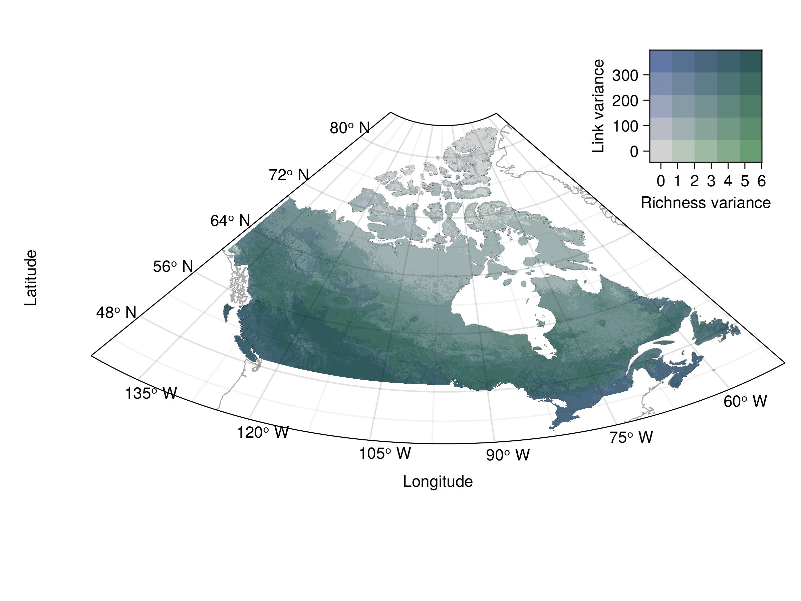

\renewcommand{\thefigure}{S\arabic{figure}}
<!-- \setcounter{figure}{0} -->

<!-- Main richness & links figures -->

  {#fig:mean_richness height=40%}

  {#fig:mean_links height=40%}

Site-level examples of a community measure (a, expected species richness) and a network one (b, expected number of links). Both measures are assembled from the predicted probabilistic communities and networks, respectively. Values are measured separately for all sites and represented directly unlike in the main text where they are later summarized by ecoregion.

<!-- Bivariate figures -->

  {#fig:bivariate_estimates height=40%}

  {#fig:bivariate_uncertainty height=40%}

Bivariate representation of the estimates (a) and uncertainty (b) of species richness and the number of links. Values are grouped into three quantiles separately for each variable. The colour combinations represent the nine possible combinations of quantiles. The richness (horizontal axis) goes left to right from low richness (light grey, bottom left) to high richness (green, bottom right). The number of links goes bottom-up from low (light grey, bottom left) to high (blue, top left). Variance measures (b) for richness and links are computed respectively as the sum of all occurrence and interaction probabilities in each site.

\newpage

<!-- LCBD -->

![Bivariate representation of species and network composition uniqueness. Values are grouped into three quantiles separately for each variable. The colour combinations represent the nine possible combinations of quantiles. The species composition uniqueness (horizontal axis) goes left to right from low uniqueness (light grey, bottom left) to high uniqueness (cyan, bottom right). The network uniqueness (vertical axis) goes bottom-up from low uniqueness (light grey, bottom left) to high uniqueness (pink, top left).](figures/lcbd_bivariate_mean.png){#fig:lcbd_bivariate}

\newpage

<!-- LCBD densities -->

![Difference in the grouping of the sites identified as unique only for their networks (pink) or only their species composition (cyan). Sites unique only for their species composition mostly have high species richness and a high number of links while sites unique for their network composition only have low richness and number of links. Other sites not belonging to the unique species or network groups are shown in the background (black) and span a wider range. Values on the y-axis for the density figures (right) are probability densities scaled so that the area under the curve equals one. Similarly, the area under the curve for a given range of values on the x-axis (richness or links) represents the probability of observing a value in that range for the different site groupings.](figures/lcbd_bivariate_densities.png){#fig:lcbd_scatter}

\newpage

<!-- Sampling options -->

{#fig:sampling_options}