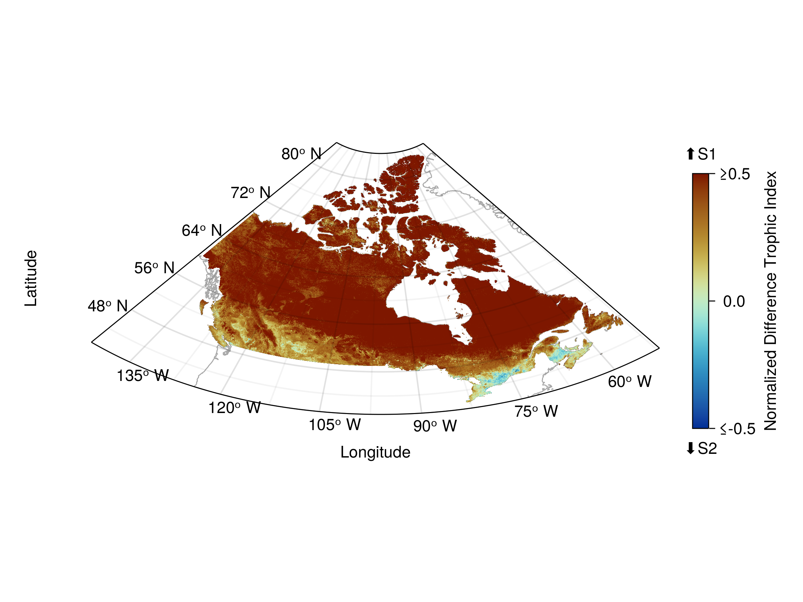

\renewcommand{\thefigure}{S\arabic{figure}}
<!-- \setcounter{figure}{0} -->

\newpage

### Supplementary ecoregion-level figure

<!-- Ecoregion bivariate -->

![Bivariate relationship between community and network measures for the median ecoregion value (A) and the within-ecoregion 89% interquantile range (B). Values are grouped into five quantiles separately for each variable. The colour combinations represent the nine possible combinations of quantiles. Species richness (horizontal axis) goes left to right from low (light grey, bottom left) to high (green, bottom right). The number of links goes bottom-up from low (light grey, bottom left) to high (blue, top left).](figures/ecoregion_bivariates.png){#fig:ecoregion_bivariates height=60%}

\newpage

### Supplementary site-level figures

<!-- Sampling options -->

{#fig:sampling_options}

\newpage

<!-- Main richness & links figures -->

  {#fig:mean_richness height=40%}

  {#fig:mean_links height=40%}

Site-level examples of a community measure (a, expected species richness) and a network one (b, expected number of links). Both measures are assembled from the predicted probabilistic communities and networks, respectively. Values are measured separately for all sites and represented directly unlike in the main text where they are later summarized by ecoregion.

<!-- Bivariate figures -->

  {#fig:bivariate_estimates height=40%}

  {#fig:bivariate_uncertainty height=40%}

Bivariate representation of the estimates (a) and uncertainty (b) of species richness and the number of links. Values are grouped into three quantiles separately for each variable. The colour combinations represent the nine possible combinations of quantiles. The richness (horizontal axis) goes left to right from low richness (light grey, bottom left) to high richness (green, bottom right). The number of links goes bottom-up from low (light grey, bottom left) to high (blue, top left). Variance measures (b) for richness and links are computed respectively as the sum of all occurrence and interaction probabilities in each site.

\newpage

<!-- LCBD -->

![Bivariate representation of species and network composition uniqueness. Values are grouped into three quantiles separately for each variable. The colour combinations represent the nine possible combinations of quantiles. The species composition uniqueness (horizontal axis) goes left to right from low uniqueness (light grey, bottom left) to high uniqueness (cyan, bottom right). The network uniqueness (vertical axis) goes bottom-up from low uniqueness (light grey, bottom left) to high uniqueness (pink, top left).](figures/lcbd_bivariate_mean.png){#fig:lcbd_bivariate}

\newpage

<!-- Motif figures -->

  {#fig:motifs_ndti height=40%}

  {#fig:motifs_ndci height=40%}

Comparison of the dominant ecological motifs across ecoregions. a) Normalized Difference Index (NDTI) comparing the trophic motifs S1 (tri-trophic food chains) and S2 (omnivory). Positive values indicate a dominance of S1 while negative values indicate a dominance of S2. Values equal or superior to |0.5| are shown with the same color as they indicate a high dominance of one motif. b) Normalized Difference Index (NDCI) comparing the competition motifs S4 (exploitative competition) and S5 (apparent competition). Positive values indicate a dominance of S4 while negative values indicate a dominance of S5.

